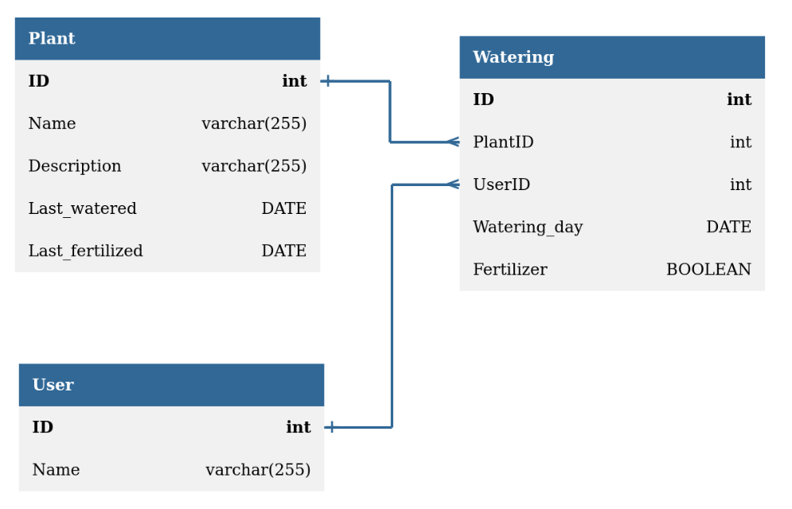

# App for keeping logs of plant watering and fertilizing

## How run 
* docker compose up
* at the moment you need to add a user with id = 1 through rest api or attaching to running mysql container

## Spring
* pretty standard REST API using @RestController
* Validation in Model classes using spring-boot-starter-validation

## Vaadin
* Database access through Controller classes. 

## MySQL

* Last_watered and Last_fertilized in Plant are updated using triggers upon insert and delete on Watering
* 
* [MySQL schema](./plantapp_schema.sql) created using $ mysqldump -u root -p --no-data plantapp > plantapp_schema.sql